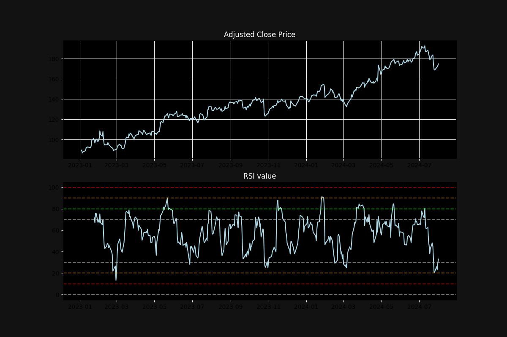

# RSI Implementation with Python

This project is a simple implementation of RSI (Relative Strength Index) analysis using Python. The script fetches historical stock data for a given ticker symbol, calculates the RSI, and plots both the adjusted close price and the RSI on a graph. This project demonstrates basic data manipulation, calculation, and visualization techniques in Python.

## What is RSI?

The Relative Strength Index (RSI) is a momentum oscillator that measures the speed and change of price movements. RSI oscillates between 0 and 100 and is typically used to identify overbought or oversold conditions in a stock. An RSI value above 70 is generally considered overbought, while an RSI value below 30 is considered oversold.

## Project Structure

The project includes the following components:

- Fetching historical stock data using `yfinance`.
- Calculating the daily price changes and separating them into gains and losses.
- Calculating the average gain and loss over a specified period (14 days by default).
- Computing the RSI based on the average gains and losses.
- Plotting the adjusted close price and RSI on a graph using `matplotlib`.

## Learnings from this Project

Through this project, I have gained insights into:

- Fetching financial data using the `yfinance` library.
- Data manipulation and rolling window calculations with `pandas`.
- Visualizing financial data using `matplotlib`.
- Understanding and implementing the RSI calculation.
- Enhancing the plot aesthetics to improve readability.

## To-Do

- [ ] Add a UI with Streamlit and host the application.
- [ ] Add a search option to allow users to input different ticker symbols.
- [ ] Add more options and better labels on the plot to enhance the user experience.
- [ ] Integrate anomaly detection program here based on user parameters.

## Usage

To run this project, you need to have Python installed along with the following libraries:

```sh
pip install pandas pandas_datareader matplotlib yfinance
```

## Example

Here is an example of how the plot looks:

- This is just a very basic implementation, I am working to add more features soon to make it aesthetically better and more insightful with appropriate finance data.



